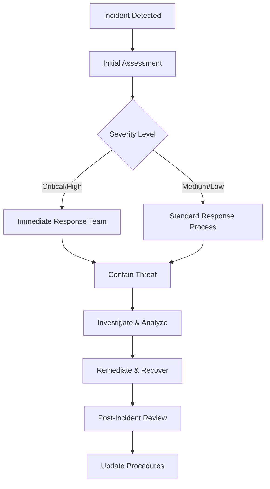

# Security Audit Schedule

## Overview

This document establishes a regular security audit schedule for the Yesman-Claude project to ensure ongoing security monitoring and continuous improvement of our security posture. The schedule includes automated checks, manual reviews, and incident response procedures.

## 🗓️ Audit Schedule

### Daily Automated Checks

**Frequency**: Every day (automated)  
**Duration**: 5-10 minutes  
**Responsibility**: Automated systems + Development team

#### Automated Tasks
- [ ] Dependency vulnerability scans (GitHub Dependabot)
- [ ] Static code analysis (Bandit, Safety) via pre-commit hooks
- [ ] Secret detection scans on new commits
- [ ] Docker image vulnerability scans (if applicable)
- [ ] Basic security headers verification

#### Implementation
```bash
# Automated daily security checks (via GitHub Actions)
name: Daily Security Scan
on:
  schedule:
    - cron: '0 8 * * *'  # Daily at 8 AM UTC
  push:
    branches: [ main, develop ]

jobs:
  security-scan:
    runs-on: ubuntu-latest
    steps:
      - uses: actions/checkout@v4
      - name: Run security checks
        run: |
          python -m pip install safety bandit
          safety check --json
          bandit -r . -f json
```

### Weekly Security Reviews

**Frequency**: Every Monday  
**Duration**: 30-60 minutes  
**Responsibility**: Tech Lead + Security Champion

#### Review Checklist
- [ ] Review automated scan results from the past week
- [ ] Check for new CVEs affecting our dependencies
- [ ] Review access logs for suspicious activities
- [ ] Validate security configurations haven't regressed
- [ ] Review any security-related GitHub issues or PRs
- [ ] Update security documentation if needed

#### Deliverables
- Weekly security status report
- Action items for addressing findings
- Updated risk assessment (if needed)

### Monthly Security Assessments

**Frequency**: First Monday of each month  
**Duration**: 2-4 hours  
**Responsibility**: Development Team + External Security Consultant (if available)

#### Assessment Areas

1. **Code Security Review**
   - Manual code review of security-critical components
   - Authentication and authorization logic
   - Input validation and sanitization
   - Error handling and logging

2. **Infrastructure Security**
   - Server configuration review
   - Network security settings
   - SSL/TLS configuration validation
   - Backup security and encryption

3. **Dependency Management**
   - Complete dependency audit
   - License compliance check
   - Alternative package evaluation for vulnerable dependencies
   - Update strategy validation

4. **Access Control Review**
   - User permissions audit
   - API key rotation status
   - Service account permissions
   - Administrative access review

#### Monthly Security Report Template

```markdown
# Monthly Security Assessment - [Month Year]

## Executive Summary
- Overall security status: [Green/Yellow/Red]
- Critical issues found: [Number]
- Issues resolved: [Number]
- New risks identified: [Number]

## Findings Summary

### Critical Issues (P0)
- [ ] Issue 1: Description
- [ ] Issue 2: Description

### High Priority Issues (P1)
- [ ] Issue 1: Description
- [ ] Issue 2: Description

### Medium Priority Issues (P2)
- [ ] Issue 1: Description

## Metrics
- Dependencies with known vulnerabilities: [Number]
- Security test coverage: [Percentage]
- Time to fix critical vulnerabilities: [Average days]
- Security incidents: [Number]

## Recommendations
1. Action item 1
2. Action item 2
3. Action item 3

## Next Month's Focus Areas
1. Focus area 1
2. Focus area 2
```

### Quarterly Comprehensive Security Audits

**Frequency**: Every 3 months (January, April, July, October)  
**Duration**: 1-2 days  
**Responsibility**: Full Development Team + External Security Firm (recommended)

#### Audit Scope

1. **Application Security Testing**
   - Static Application Security Testing (SAST)
   - Dynamic Application Security Testing (DAST)
   - Interactive Application Security Testing (IAST)
   - Penetration testing

2. **Architecture Security Review**
   - Threat modeling update
   - Security architecture assessment
   - Data flow security analysis
   - Third-party integration security

3. **Compliance Assessment**
   - OWASP Top 10 compliance check
   - Industry standard compliance (if applicable)
   - Internal security policy compliance
   - Documentation completeness review

4. **Incident Response Testing**
   - Tabletop exercises
   - Response plan validation
   - Communication procedure testing
   - Recovery procedure validation

#### Comprehensive Audit Checklist

**Pre-Audit Preparation**
- [ ] Update threat model
- [ ] Gather security metrics
- [ ] Prepare test environments
- [ ] Coordinate with stakeholders

**Technical Security Assessment**
- [ ] Automated vulnerability scanning
- [ ] Manual penetration testing
- [ ] Code security review
- [ ] Configuration security review
- [ ] Data protection assessment
- [ ] Authentication/authorization testing
- [ ] Session management testing
- [ ] Input validation testing
- [ ] Business logic security testing
- [ ] API security assessment

**Process and Documentation Review**
- [ ] Security policies review
- [ ] Incident response procedures
- [ ] Security training records
- [ ] Change management processes
- [ ] Security metrics analysis
- [ ] Vendor security assessments

**Post-Audit Activities**
- [ ] Findings prioritization
- [ ] Remediation planning
- [ ] Risk acceptance decisions
- [ ] Security roadmap updates
- [ ] Stakeholder communication

### Annual Security Architecture Reviews

**Frequency**: Once per year (recommended: Q4)  
**Duration**: 1 week  
**Responsibility**: Senior Technical Team + External Security Architecture Consultant

#### Review Scope

1. **Strategic Security Planning**
   - Security roadmap review and planning
   - Threat landscape assessment
   - Security technology evaluation
   - Budget planning for security initiatives

2. **Comprehensive Risk Assessment**
   - Business impact analysis
   - Threat actor profiling
   - Attack surface analysis
   - Risk mitigation strategy review

3. **Security Architecture Evolution**
   - Architecture pattern security review
   - Zero-trust implementation planning
   - Cloud security strategy (if applicable)
   - DevSecOps maturity assessment

## 📋 Security Monitoring and Metrics

### Key Security Metrics (KPIs)

#### Vulnerability Management
- **Time to Detection**: Average time to identify vulnerabilities
- **Time to Fix**: Average time from detection to remediation
- **Vulnerability Density**: Number of vulnerabilities per 1000 lines of code
- **Critical Vulnerability Backlog**: Number of unresolved critical vulnerabilities

#### Security Testing
- **Security Test Coverage**: Percentage of code covered by security tests
- **Automated Scan Success Rate**: Percentage of successful automated scans
- **False Positive Rate**: Percentage of false positives in security scans

#### Incident Response
- **Mean Time to Detection (MTTD)**: Average time to detect security incidents
- **Mean Time to Response (MTTR)**: Average time to respond to incidents
- **Incident Volume**: Number of security incidents per month
- **Repeat Incidents**: Number of recurring security issues

#### Compliance and Training
- **Security Training Completion**: Percentage of team completing security training
- **Policy Compliance Rate**: Percentage compliance with security policies
- **Audit Finding Resolution Rate**: Percentage of audit findings resolved on time

### Metrics Collection Tools

```python
# Example metrics collection script
class SecurityMetrics:
    def __init__(self):
        self.metrics_file = "security_metrics.json"
    
    def collect_vulnerability_metrics(self):
        """Collect vulnerability-related metrics."""
        return {
            "total_dependencies": self.count_dependencies(),
            "vulnerable_dependencies": self.count_vulnerable_dependencies(),
            "critical_vulnerabilities": self.count_critical_vulnerabilities(),
            "last_update": datetime.now().isoformat()
        }
    
    def collect_test_metrics(self):
        """Collect security testing metrics."""
        return {
            "security_tests_total": self.count_security_tests(),
            "security_tests_passing": self.count_passing_security_tests(),
            "coverage_percentage": self.get_security_test_coverage(),
            "last_run": self.get_last_test_run_time()
        }
    
    def generate_dashboard_data(self):
        """Generate data for security metrics dashboard."""
        return {
            "vulnerabilities": self.collect_vulnerability_metrics(),
            "testing": self.collect_test_metrics(),
            "incidents": self.collect_incident_metrics(),
            "generated_at": datetime.now().isoformat()
        }
```

## 🚨 Incident Response Integration

### Security Incident Classification

#### Severity Levels

**Critical (P0)**
- Active security breach
- Data exfiltration confirmed
- System compromise with admin access
- Response Time: Immediate (< 1 hour)

**High (P1)**
- Suspected security breach
- Vulnerability with active exploitation
- Authentication bypass
- Response Time: Same day (< 4 hours)

**Medium (P2)**
- Security vulnerability discovered
- Policy violation
- Suspicious activity detected
- Response Time: Next business day (< 24 hours)

**Low (P3)**
- Minor security concerns
- Compliance issues
- Documentation gaps
- Response Time: Within one week

### Incident Response Workflow



### Response Team Contacts

#### Primary Response Team
- **Incident Commander**: [Name] - [Phone] - [Email]
- **Technical Lead**: [Name] - [Phone] - [Email]
- **Security Champion**: [Name] - [Phone] - [Email]

#### Secondary Contacts
- **Project Manager**: [Name] - [Phone] - [Email]
- **External Security Consultant**: [Company] - [Contact Info]
- **Legal Counsel**: [Name] - [Phone] - [Email] (for data breaches)

### Communication Templates

#### Internal Security Alert
```
SUBJECT: [SEVERITY] Security Incident - [Brief Description]

Incident ID: SEC-YYYY-NNNN
Detected: [Timestamp]
Severity: [Critical/High/Medium/Low]
Status: [Investigating/Contained/Resolved]

Summary:
[Brief description of the incident]

Impact:
[Description of systems/data affected]

Actions Taken:
- [Action 1]
- [Action 2]

Next Steps:
- [Next step 1]
- [Next step 2]

Point of Contact: [Name] ([Email])
```

## 🔄 Continuous Improvement

### Audit Process Improvement

#### Quarterly Process Review
- Review audit effectiveness
- Gather feedback from team members
- Update procedures based on lessons learned
- Benchmark against industry standards

#### Annual Process Evolution
- Evaluate new security tools and techniques
- Update audit scope based on threat landscape
- Revise metrics and KPIs
- Plan training and skill development

### Security Culture Development

#### Training Schedule
- **New Team Members**: Security onboarding within first week
- **All Team Members**: Quarterly security awareness training
- **Technical Staff**: Annual advanced security training
- **Leadership**: Semi-annual security leadership briefings

#### Knowledge Sharing
- Monthly "Security Spotlight" presentations
- Quarterly threat intelligence briefings
- Annual security conference attendance (for key personnel)
- Internal security wiki maintenance

## 📊 Audit Scheduling and Tracking

### 2025 Security Audit Calendar

| Date | Type | Duration | Responsibility | Status |
|------|------|----------|---------------|---------|
| Jan 6, 2025 | Monthly Assessment | 3 hours | Dev Team | Scheduled |
| Jan 13, 2025 | Weekly Review | 1 hour | Tech Lead | Scheduled |
| Jan 20, 2025 | Weekly Review | 1 hour | Tech Lead | Scheduled |
| Jan 27, 2025 | Weekly Review | 1 hour | Tech Lead | Scheduled |
| Feb 3, 2025 | Monthly Assessment | 3 hours | Dev Team | Scheduled |
| Apr 7, 2025 | Quarterly Audit | 2 days | Full Team + External | Scheduled |
| Jul 7, 2025 | Quarterly Audit | 2 days | Full Team + External | Scheduled |
| Oct 6, 2025 | Quarterly Audit | 2 days | Full Team + External | Scheduled |
| Dec 1, 2025 | Annual Architecture Review | 1 week | Senior Team + External | Scheduled |

### Tracking Template

```yaml
# Security Audit Tracking
audit_schedule:
  2025:
    q1:
      monthly:
        - date: "2025-01-06"
          type: "monthly_assessment"
          status: "scheduled"
          findings: null
          remediation_deadline: null
      weekly:
        - date: "2025-01-13"
          type: "weekly_review"
          status: "scheduled"
    quarterly:
      q1:
        date: "2025-04-07"
        type: "comprehensive_audit"
        external_auditor: "TBD"
        status: "scheduled"
```

## 📚 Resources and References

### External Security Resources
- [OWASP Web Security Testing Guide](https://owasp.org/www-project-web-security-testing-guide/)
- [NIST Cybersecurity Framework](https://www.nist.gov/cyberframework)
- [CIS Controls](https://www.cisecurity.org/controls/)
- [SANS Security Policies](https://www.sans.org/information-security-policy/)

### Security Tools and Services
- **SAST Tools**: Bandit, Semgrep, CodeQL
- **DAST Tools**: OWASP ZAP, Burp Suite
- **Dependency Scanning**: Safety, Snyk, GitHub Dependabot
- **Secret Detection**: detect-secrets, GitLeaks, TruffleHog

### Emergency Contacts
- **Cyber Emergency Response Team**: [Contact Information]
- **Cloud Provider Security**: [AWS/Azure/GCP Security Contact]
- **Domain Registrar**: [Contact Information]
- **Certificate Authority**: [Contact Information]

---

**Document Version**: 1.0  
**Last Updated**: 2025-01-11  
**Next Review Date**: 2025-04-11  
**Document Owner**: Security Team  
**Approved By**: [Technical Lead Name]