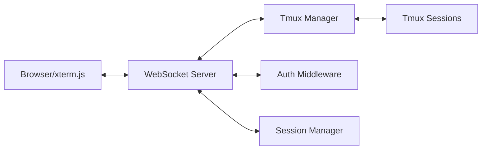

# WebSocket Terminal Integration Plan

## 📋 Overview

Enable browser-based access to Claude sessions through WebSocket protocol, allowing users to interact with tmux sessions
directly from the Tauri dashboard or any web browser.

## 🎯 Goals

### Primary Goals

- Real-time terminal rendering in browser
- Bidirectional communication with tmux sessions
- Seamless integration with existing dashboard
- Support for multiple concurrent terminal sessions

### Success Criteria

- < 50ms latency for keystroke to display
- Support 100+ concurrent connections
- 99.9% message delivery reliability
- Zero terminal state desynchronization

## 🏗️ Technical Architecture

### Components



### Technology Stack

- **Frontend**: xterm.js + xterm-addon-websocket
- **WebSocket**: FastAPI WebSocket endpoints
- **Backend**: Python asyncio + aioredis
- **Protocol**: Custom JSON-RPC over WebSocket

## 📐 Detailed Design

### 1. WebSocket Protocol

```typescript
// Message Types
interface TerminalMessage {
  type: 'input' | 'output' | 'resize' | 'connect' | 'disconnect';
  sessionId: string;
  data?: string;
  cols?: number;
  rows?: number;
  timestamp: number;
}

// Connection Flow
1. Client -> Server: { type: 'connect', sessionId: 'xyz' }
2. Server -> Client: { type: 'output', data: 'initial content' }
3. Client -> Server: { type: 'input', data: 'ls\n' }
4. Server -> Client: { type: 'output', data: 'file1.txt file2.txt' }
```

### 2. Backend Implementation

```python
# api/websocket/terminal.py
from fastapi import WebSocket, WebSocketDisconnect
from typing import Dict
import asyncio
import json

class TerminalWebSocketManager:
    def __init__(self):
        self.active_connections: Dict[str, WebSocket] = {}
        self.session_streams: Dict[str, asyncio.Queue] = {}
    
    async def connect(self, websocket: WebSocket, session_id: str):
        await websocket.accept()
        self.active_connections[session_id] = websocket
        self.session_streams[session_id] = asyncio.Queue()
        
    async def handle_terminal_io(self, session_id: str):
        """Bridge between tmux and WebSocket"""
        while True:
            # Read from tmux
            output = await self.read_tmux_output(session_id)
            if output:
                await self.send_to_client(session_id, {
                    'type': 'output',
                    'data': output
                })
```

### 3. Frontend Integration

```typescript
// tauri-dashboard/src/lib/terminal/WebSocketTerminal.ts
import { Terminal } from 'xterm';
import { WebSocketAddon } from 'xterm-addon-websocket';

export class WebSocketTerminal {
  private terminal: Terminal;
  private ws: WebSocket;
  
  constructor(container: HTMLElement, sessionId: string) {
    this.terminal = new Terminal({
      cursorBlink: true,
      fontSize: 14,
      theme: {
        background: '#1e1e1e',
        foreground: '#d4d4d4'
      }
    });
    
    this.terminal.open(container);
    this.connectWebSocket(sessionId);
  }
  
  private connectWebSocket(sessionId: string) {
    const wsUrl = `ws://localhost:8000/ws/terminal/${sessionId}`;
    this.ws = new WebSocket(wsUrl);
    
    this.ws.onmessage = (event) => {
      const message = JSON.parse(event.data);
      if (message.type === 'output') {
        this.terminal.write(message.data);
      }
    };
    
    this.terminal.onData((data) => {
      this.ws.send(JSON.stringify({
        type: 'input',
        data: data
      }));
    });
  }
}
```

## 🔄 Implementation Phases

### Phase 1: Basic WebSocket Connection (3 days)

- [ ] Create WebSocket endpoint in FastAPI
- [ ] Implement basic message protocol
- [ ] Set up xterm.js in dashboard
- [ ] Test basic input/output flow

### Phase 2: Tmux Integration (4 days)

- [ ] Create tmux output capture mechanism
- [ ] Implement input injection to tmux
- [ ] Handle terminal resize events
- [ ] Manage session lifecycle

### Phase 3: Advanced Features (3 days)

- [ ] Add authentication/authorization
- [ ] Implement connection pooling
- [ ] Add reconnection logic
- [ ] Create terminal multiplexing

### Phase 4: UI/UX Polish (2 days)

- [ ] Add terminal themes
- [ ] Implement copy/paste support
- [ ] Add fullscreen mode
- [ ] Create terminal tabs

### Phase 5: Testing & Documentation (2 days)

- [ ] Unit tests for WebSocket handlers
- [ ] Integration tests with tmux
- [ ] Load testing with multiple connections
- [ ] API documentation

## 🧪 Testing Strategy

### Unit Tests

```python
# tests/test_websocket_terminal.py
async def test_websocket_connection():
    client = TestClient(app)
    with client.websocket_connect("/ws/terminal/test-session") as ws:
        ws.send_json({"type": "connect", "sessionId": "test-session"})
        data = ws.receive_json()
        assert data["type"] == "connected"

async def test_terminal_input_output():
    # Test that input is properly forwarded to tmux
    # Test that tmux output is sent to client
```

### Integration Tests

- Test with real tmux sessions
- Verify terminal state synchronization
- Test reconnection scenarios
- Validate performance under load

### Load Tests

```yaml
# k6 load test script
import ws from 'k6/ws';

export default function() {
  const url = 'ws://localhost:8000/ws/terminal/load-test';
  ws.connect(url, function(socket) {
    socket.on('open', () => {
      socket.send(JSON.stringify({type: 'input', data: 'ls\n'}));
    });
  });
}
```

## 📊 Performance Requirements

### Latency Targets

- Input to tmux: < 10ms
- Tmux to output: < 20ms
- Total round trip: < 50ms

### Scalability Targets

- 100 concurrent terminals
- 1000 messages/second per terminal
- < 10MB memory per connection

### Reliability Targets

- 99.9% uptime
- Automatic reconnection within 5s
- No data loss during reconnection

## 🔒 Security Considerations

### Authentication

- WebSocket connections require valid JWT token
- Session access validated against user permissions
- Token refresh handled transparently

### Authorization

- Users can only access their own sessions
- Admin users can access all sessions
- Read-only mode for certain roles

### Data Protection

- All WebSocket traffic over WSS (TLS)
- Input sanitization to prevent injection
- Output filtering for sensitive data

## 🚧 Risks & Mitigations

### Technical Risks

1. **Terminal state desync**

   - Mitigation: Periodic full state refresh
   - Fallback: Manual refresh button

1. **High latency networks**

   - Mitigation: Client-side prediction
   - Buffering strategies

1. **Browser compatibility**

   - Mitigation: Polyfills for older browsers
   - Fallback to basic terminal

### Operational Risks

1. **Resource exhaustion**

   - Mitigation: Connection limits
   - Resource quotas per user

1. **Security vulnerabilities**

   - Mitigation: Regular security audits
   - Penetration testing

## 📈 Success Metrics

### Technical Metrics

- Average latency: < 30ms
- 99th percentile latency: < 100ms
- Connection success rate: > 99.5%
- Memory usage per connection: < 5MB

### User Metrics

- Feature adoption rate: > 70%
- User satisfaction: > 4.5/5
- Support tickets: < 5 per week
- Daily active terminals: > 100

## 🔗 Dependencies

### External Libraries

- xterm.js: ^5.3.0
- xterm-addon-websocket: ^0.14.0
- FastAPI: ^0.104.0
- python-asyncio: standard library

### Internal Dependencies

- TmuxManager: Current implementation
- SessionManager: Current implementation
- Authentication system: To be implemented

## 📚 References

- [xterm.js Documentation](https://xtermjs.org/docs/)
- [FastAPI WebSocket Guide](https://fastapi.tiangolo.com/advanced/websockets/)
- [tmux Control Mode](https://man.openbsd.org/tmux#CONTROL_MODE)
- [WebSocket Protocol RFC](https://tools.ietf.org/html/rfc6455)

## ✅ Definition of Done

- [ ] All unit tests passing (> 90% coverage)
- [ ] Integration tests passing
- [ ] Load tests meeting performance targets
- [ ] Security review completed
- [ ] Documentation updated
- [ ] Code reviewed and approved
- [ ] Deployed to staging environment
- [ ] User acceptance testing passed

______________________________________________________________________

**Created**: 2025-01-08 **Owner**: Backend Team **Status**: Planning **Estimated Effort**: 14 days
