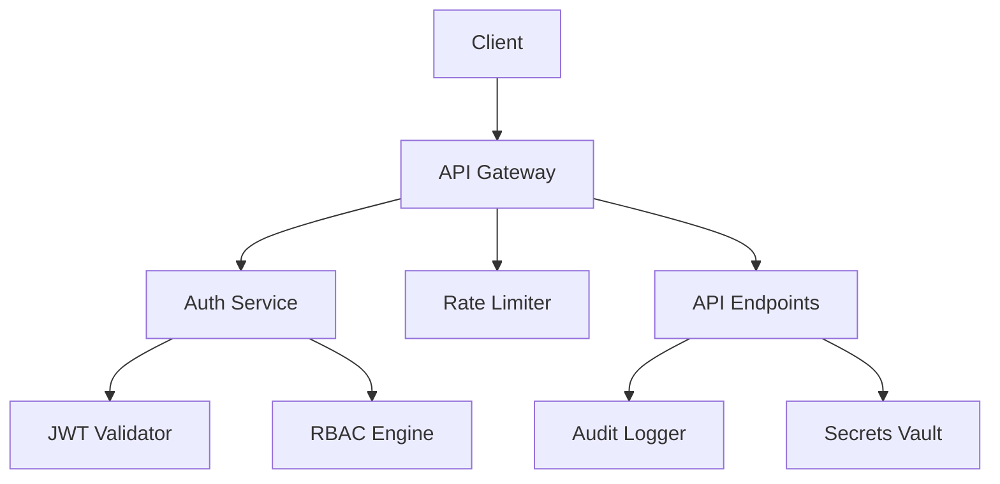

# Security Hardening Implementation Plan

## 📋 Overview

Implement comprehensive security measures to make yesman-claude enterprise-ready, including authentication,
authorization, input validation, and audit logging.

## 🎯 Goals

### Primary Goals

- Implement JWT-based authentication system
- Add role-based access control (RBAC)
- Secure all API endpoints
- Create comprehensive audit trail
- Implement rate limiting and DDoS protection

### Success Criteria

- Zero security vulnerabilities in OWASP Top 10
- < 10ms authentication overhead
- 100% API endpoint coverage
- Complete audit trail for all actions

## 🏗️ Security Architecture

### Components Overview



### Security Layers

1. **Network Security**: TLS/SSL, firewall rules
1. **Application Security**: Input validation, CSRF protection
1. **Data Security**: Encryption at rest and in transit
1. **Access Control**: Authentication and authorization
1. **Monitoring**: Audit logs, intrusion detection

## 📐 Detailed Design

### 1. Authentication System

```python
# libs/security/authentication.py
from datetime import datetime, timedelta
from typing import Optional, Dict, Any
from jose import JWTError, jwt
from passlib.context import CryptContext
from pydantic import BaseModel

class TokenData(BaseModel):
    username: str
    user_id: str
    roles: List[str]
    expires_at: datetime

class AuthenticationService:
    def __init__(self):
        self.pwd_context = CryptContext(schemes=["bcrypt"], deprecated="auto")
        self.secret_key = self._load_secret_key()
        self.algorithm = "HS256"
        self.access_token_expire = timedelta(hours=24)
        self.refresh_token_expire = timedelta(days=30)
    
    def create_access_token(self, user_data: Dict[str, Any]) -> str:
        """Create JWT access token"""
        to_encode = user_data.copy()
        expire = datetime.utcnow() + self.access_token_expire
        to_encode.update({"exp": expire, "type": "access"})
        
        return jwt.encode(to_encode, self.secret_key, algorithm=self.algorithm)
    
    def verify_token(self, token: str) -> Optional[TokenData]:
        """Verify and decode JWT token"""
        try:
            payload = jwt.decode(token, self.secret_key, algorithms=[self.algorithm])
            return TokenData(**payload)
        except JWTError:
            return None
    
    def hash_password(self, password: str) -> str:
        """Hash password using bcrypt"""
        return self.pwd_context.hash(password)
    
    def verify_password(self, plain_password: str, hashed_password: str) -> bool:
        """Verify password against hash"""
        return self.pwd_context.verify(plain_password, hashed_password)
```

### 2. Role-Based Access Control (RBAC)

```python
# libs/security/rbac.py
from enum import Enum
from typing import List, Set, Dict
from functools import wraps

class Role(Enum):
    ADMIN = "admin"
    USER = "user"
    VIEWER = "viewer"
    GUEST = "guest"

class Permission(Enum):
    # Session permissions
    SESSION_CREATE = "session:create"
    SESSION_READ = "session:read"
    SESSION_UPDATE = "session:update"
    SESSION_DELETE = "session:delete"
    
    # Controller permissions
    CONTROLLER_START = "controller:start"
    CONTROLLER_STOP = "controller:stop"
    CONTROLLER_CONFIG = "controller:config"
    
    # System permissions
    SYSTEM_CONFIG = "system:config"
    SYSTEM_HEALTH = "system:health"
    AUDIT_READ = "audit:read"

class RBACEngine:
    def __init__(self):
        self.role_permissions: Dict[Role, Set[Permission]] = {
            Role.ADMIN: set(Permission),  # All permissions
            Role.USER: {
                Permission.SESSION_CREATE,
                Permission.SESSION_READ,
                Permission.SESSION_UPDATE,
                Permission.SESSION_DELETE,
                Permission.CONTROLLER_START,
                Permission.CONTROLLER_STOP,
                Permission.SYSTEM_HEALTH,
            },
            Role.VIEWER: {
                Permission.SESSION_READ,
                Permission.SYSTEM_HEALTH,
            },
            Role.GUEST: {
                Permission.SYSTEM_HEALTH,
            }
        }
    
    def check_permission(self, user_roles: List[str], required_permission: Permission) -> bool:
        """Check if user has required permission"""
        for role_str in user_roles:
            try:
                role = Role(role_str)
                if required_permission in self.role_permissions.get(role, set()):
                    return True
            except ValueError:
                continue
        return False
    
    def require_permission(self, permission: Permission):
        """Decorator for permission-based access control"""
        def decorator(func):
            @wraps(func)
            async def wrapper(*args, **kwargs):
                # Extract user from request context
                request = kwargs.get('request') or args[0]
                user = getattr(request.state, 'user', None)
                
                if not user:
                    raise HTTPException(
                        status_code=401,
                        detail="Authentication required"
                    )
                
                if not self.check_permission(user.roles, permission):
                    raise HTTPException(
                        status_code=403,
                        detail=f"Permission denied: {permission.value}"
                    )
                
                return await func(*args, **kwargs)
            return wrapper
        return decorator
```

### 3. API Security Middleware

```python
# api/middleware/security.py
from fastapi import Request, HTTPException
from fastapi.security import HTTPBearer, HTTPAuthorizationCredentials
from starlette.middleware.base import BaseHTTPMiddleware
import time
import hashlib

class SecurityMiddleware(BaseHTTPMiddleware):
    def __init__(self, app, auth_service: AuthenticationService):
        super().__init__(app)
        self.auth_service = auth_service
        self.security = HTTPBearer()
    
    async def dispatch(self, request: Request, call_next):
        # Skip auth for public endpoints
        if request.url.path in ["/health", "/docs", "/openapi.json"]:
            return await call_next(request)
        
        # Validate authentication
        try:
            credentials = await self.security(request)
            token_data = self.auth_service.verify_token(credentials.credentials)
            
            if not token_data:
                raise HTTPException(status_code=401, detail="Invalid token")
            
            # Add user to request state
            request.state.user = token_data
            
        except HTTPException:
            raise
        except Exception as e:
            raise HTTPException(status_code=401, detail="Authentication failed")
        
        # Add security headers
        response = await call_next(request)
        response.headers["X-Content-Type-Options"] = "nosniff"
        response.headers["X-Frame-Options"] = "DENY"
        response.headers["X-XSS-Protection"] = "1; mode=block"
        response.headers["Strict-Transport-Security"] = "max-age=31536000; includeSubDomains"
        
        return response
```

### 4. Input Validation & Sanitization

```python
# libs/security/validation.py
import re
from typing import Any, Dict, List
import bleach
from pydantic import BaseModel, validator

class InputValidator:
    # Dangerous patterns
    SQL_INJECTION_PATTERNS = [
        r"(\b(SELECT|INSERT|UPDATE|DELETE|DROP|UNION|CREATE|ALTER)\b)",
        r"(--|;|\/\*|\*\/|@@|@)",
        r"(\bOR\b.*\b=\b.*\b=\b)",
        r"(\bAND\b.*\b=\b.*\b=\b)",
    ]
    
    XSS_PATTERNS = [
        r"<script[^>]*>.*?</script>",
        r"javascript:",
        r"on\w+\s*=",
        r"<iframe[^>]*>",
    ]
    
    PATH_TRAVERSAL_PATTERNS = [
        r"\.\./",
        r"\.\\.\\",
        r"%2e%2e/",
        r"%252e%252e/",
    ]
    
    @classmethod
    def validate_session_name(cls, value: str) -> str:
        """Validate session name format"""
        if not re.match(r'^[a-zA-Z0-9_-]{1,64}$', value):
            raise ValueError("Invalid session name format")
        
        # Check for dangerous patterns
        for pattern in cls.SQL_INJECTION_PATTERNS + cls.PATH_TRAVERSAL_PATTERNS:
            if re.search(pattern, value, re.IGNORECASE):
                raise ValueError("Potentially dangerous input detected")
        
        return value
    
    @classmethod
    def sanitize_user_input(cls, value: str) -> str:
        """Sanitize user input for display"""
        # Remove HTML tags and dangerous content
        cleaned = bleach.clean(value, tags=[], strip=True)
        
        # Escape special characters
        cleaned = cleaned.replace("&", "&amp;")
        cleaned = cleaned.replace("<", "&lt;")
        cleaned = cleaned.replace(">", "&gt;")
        cleaned = cleaned.replace('"', "&quot;")
        cleaned = cleaned.replace("'", "&#x27;")
        
        return cleaned
    
    @classmethod
    def validate_file_path(cls, path: str) -> str:
        """Validate file path to prevent traversal attacks"""
        # Normalize path
        normalized = os.path.normpath(path)
        
        # Check for traversal attempts
        if ".." in normalized or normalized.startswith("/"):
            raise ValueError("Invalid file path")
        
        # Check against patterns
        for pattern in cls.PATH_TRAVERSAL_PATTERNS:
            if re.search(pattern, path):
                raise ValueError("Path traversal attempt detected")
        
        return normalized
```

### 5. Rate Limiting

```python
# libs/security/rate_limiter.py
from typing import Dict, Optional
import time
import asyncio
from collections import defaultdict
import aioredis

class RateLimiter:
    def __init__(self, redis_url: str = "redis://localhost"):
        self.redis_url = redis_url
        self.redis: Optional[aioredis.Redis] = None
        self.local_cache = defaultdict(list)  # Fallback for Redis failure
        
    async def connect(self):
        """Connect to Redis"""
        self.redis = await aioredis.create_redis_pool(self.redis_url)
    
    async def is_allowed(self, 
                        identifier: str, 
                        max_requests: int = 60, 
                        window_seconds: int = 60) -> bool:
        """Check if request is allowed under rate limit"""
        current_time = time.time()
        key = f"rate_limit:{identifier}"
        
        try:
            if self.redis:
                # Use Redis for distributed rate limiting
                pipe = self.redis.pipeline()
                pipe.zadd(key, current_time, current_time)
                pipe.zremrangebyscore(key, 0, current_time - window_seconds)
                pipe.zcard(key)
                pipe.expire(key, window_seconds + 1)
                results = await pipe.execute()
                
                request_count = results[2]
                return request_count <= max_requests
            else:
                # Fallback to local rate limiting
                requests = self.local_cache[identifier]
                
                # Remove old requests
                requests[:] = [t for t in requests if t > current_time - window_seconds]
                
                if len(requests) < max_requests:
                    requests.append(current_time)
                    return True
                return False
                
        except Exception as e:
            # On error, allow request but log the issue
            print(f"Rate limiter error: {e}")
            return True
    
    def rate_limit_decorator(self, max_requests: int = 60, window_seconds: int = 60):
        """Decorator for rate limiting endpoints"""
        def decorator(func):
            @wraps(func)
            async def wrapper(request: Request, *args, **kwargs):
                # Use IP address as identifier
                identifier = request.client.host
                
                if not await self.is_allowed(identifier, max_requests, window_seconds):
                    raise HTTPException(
                        status_code=429,
                        detail="Rate limit exceeded"
                    )
                
                return await func(request, *args, **kwargs)
            return wrapper
        return decorator
```

### 6. Audit Logging

```python
# libs/security/audit.py
from datetime import datetime
from typing import Dict, Any, Optional
import json
from enum import Enum

class AuditEventType(Enum):
    # Authentication events
    LOGIN_SUCCESS = "auth.login.success"
    LOGIN_FAILURE = "auth.login.failure"
    LOGOUT = "auth.logout"
    TOKEN_REFRESH = "auth.token.refresh"
    
    # Session events
    SESSION_CREATE = "session.create"
    SESSION_DELETE = "session.delete"
    SESSION_ACCESS = "session.access"
    
    # Security events
    PERMISSION_DENIED = "security.permission.denied"
    RATE_LIMIT_EXCEEDED = "security.rate_limit.exceeded"
    SUSPICIOUS_ACTIVITY = "security.suspicious"

class AuditLogger:
    def __init__(self, log_path: str = "/var/log/yesman/audit.log"):
        self.log_path = log_path
        self.buffer = []
        self.buffer_size = 100
        
    async def log_event(self,
                       event_type: AuditEventType,
                       user_id: Optional[str] = None,
                       session_id: Optional[str] = None,
                       ip_address: Optional[str] = None,
                       details: Optional[Dict[str, Any]] = None) -> None:
        """Log security audit event"""
        event = {
            "timestamp": datetime.utcnow().isoformat(),
            "event_type": event_type.value,
            "user_id": user_id,
            "session_id": session_id,
            "ip_address": ip_address,
            "details": details or {}
        }
        
        self.buffer.append(event)
        
        # Flush buffer if full
        if len(self.buffer) >= self.buffer_size:
            await self._flush_buffer()
    
    async def _flush_buffer(self):
        """Write buffered events to disk"""
        if not self.buffer:
            return
        
        try:
            with open(self.log_path, 'a') as f:
                for event in self.buffer:
                    f.write(json.dumps(event) + '\n')
            self.buffer.clear()
        except Exception as e:
            print(f"Failed to write audit log: {e}")
```

## 🔄 Implementation Phases

### Phase 1: Authentication Foundation (3 days)

- [ ] Implement JWT token generation and validation
- [ ] Create user registration and login endpoints
- [ ] Add password hashing and verification
- [ ] Set up token refresh mechanism

### Phase 2: Authorization System (3 days)

- [ ] Implement RBAC engine
- [ ] Create permission decorators
- [ ] Add role management endpoints
- [ ] Integrate with existing endpoints

### Phase 3: Security Middleware (2 days)

- [ ] Create authentication middleware
- [ ] Add security headers
- [ ] Implement CSRF protection
- [ ] Set up CORS properly

### Phase 4: Input Validation (2 days)

- [ ] Create input validators
- [ ] Add sanitization functions
- [ ] Integrate with all endpoints
- [ ] Add file upload security

### Phase 5: Rate Limiting & DDoS Protection (2 days)

- [ ] Implement rate limiter with Redis
- [ ] Add rate limiting to all endpoints
- [ ] Create IP-based blocking
- [ ] Add captcha for suspicious activity

### Phase 6: Audit & Monitoring (2 days)

- [ ] Implement audit logger
- [ ] Add audit events to all operations
- [ ] Create audit viewing endpoints
- [ ] Set up alerts for suspicious activity

## 🧪 Security Testing Strategy

### Automated Security Tests

```python
# tests/security/test_authentication.py
async def test_jwt_token_expiration():
    """Test that expired tokens are rejected"""
    expired_token = create_token_with_expiry(-3600)  # 1 hour ago
    response = client.get("/api/sessions", headers={"Authorization": f"Bearer {expired_token}"})
    assert response.status_code == 401

async def test_sql_injection_prevention():
    """Test SQL injection attempts are blocked"""
    malicious_input = "'; DROP TABLE sessions; --"
    response = client.post("/api/sessions", json={"name": malicious_input})
    assert response.status_code == 400
    assert "Invalid input" in response.json()["detail"]
```

### Penetration Testing

- OWASP ZAP automated scanning
- Manual penetration testing
- SQL injection testing with sqlmap
- XSS testing with XSStrike

### Security Checklist

- [ ] All endpoints require authentication
- [ ] Sensitive data is encrypted
- [ ] No hardcoded secrets
- [ ] Input validation on all user inputs
- [ ] Rate limiting enabled
- [ ] Audit logging functional
- [ ] Security headers present
- [ ] HTTPS enforced

## 📊 Security Metrics

### Performance Impact

- Authentication overhead: < 10ms
- Authorization check: < 5ms
- Input validation: < 2ms per field
- Total security overhead: < 20ms

### Security Coverage

- API endpoint coverage: 100%
- Input validation coverage: 100%
- Audit event coverage: > 95%
- Test coverage: > 90%

## 🔒 Secret Management

### Development

```yaml
# .env.development
JWT_SECRET_KEY=dev-secret-key-change-in-production
DATABASE_ENCRYPTION_KEY=dev-encryption-key
API_KEYS_SALT=dev-salt
```

### Production

- Use AWS Secrets Manager or HashiCorp Vault
- Rotate secrets every 90 days
- Never commit secrets to repository
- Use environment variables

## 🚨 Incident Response Plan

### Security Breach Response

1. **Detection**: Automated alerts for suspicious activity
1. **Containment**: Automatic IP blocking, session termination
1. **Investigation**: Audit log analysis, forensics
1. **Recovery**: Patch vulnerability, reset affected accounts
1. **Communication**: Notify affected users within 72 hours

### Monitoring & Alerts

- Failed login attempts > 5 in 5 minutes
- Rate limit exceeded > 10 times
- Unauthorized access attempts
- Suspicious input patterns

## 📚 Security Standards Compliance

### OWASP Top 10 Coverage

- [x] A01: Broken Access Control
- [x] A02: Cryptographic Failures
- [x] A03: Injection
- [x] A04: Insecure Design
- [x] A05: Security Misconfiguration
- [x] A06: Vulnerable Components
- [x] A07: Authentication Failures
- [x] A08: Data Integrity Failures
- [x] A09: Security Logging Failures
- [x] A10: SSRF

### GDPR Compliance

- User consent for data collection
- Right to erasure implementation
- Data portability features
- Privacy by design

## ✅ Definition of Done

- [ ] All security tests passing
- [ ] Penetration testing completed
- [ ] Security review by external auditor
- [ ] Documentation updated
- [ ] Incident response plan tested
- [ ] Team training completed
- [ ] Security monitoring active
- [ ] Compliance requirements met

______________________________________________________________________

**Created**: 2025-01-08 **Owner**: Security Team **Status**: Planning **Estimated Effort**: 14 days
