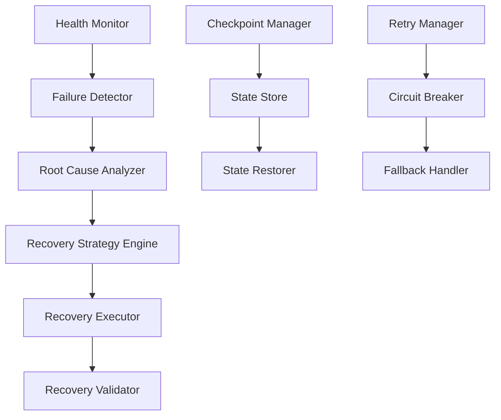

# Error Recovery System Implementation Plan

## 📋 Overview

Implement a comprehensive error recovery system that ensures yesman-claude can automatically recover from failures,
maintain session state, and provide seamless user experience even during unexpected interruptions.

## 🎯 Goals

### Primary Goals

- Zero data loss during failures
- Automatic session recovery within 30 seconds
- Intelligent retry mechanisms with exponential backoff
- Transaction-like operations with rollback capability
- Comprehensive failure detection and healing

### Success Criteria

- 99.9% recovery success rate
- < 30s mean time to recovery (MTTR)
- Zero manual intervention for common failures
- Complete audit trail of recovery actions

## 🏗️ Recovery Architecture

### System Components



### Recovery Layers

1. **Process Level**: Supervisor pattern for process monitoring
1. **Session Level**: Tmux session state preservation
1. **Application Level**: Transaction and rollback support
1. **Data Level**: Checkpoint and restore mechanisms
1. **System Level**: Health checks and self-healing

## 📐 Detailed Design

### 1. Checkpoint System

```python
# libs/recovery/checkpoint.py
from typing import Dict, Any, Optional, List
import pickle
import json
import time
from pathlib import Path
from dataclasses import dataclass
import hashlib

@dataclass
class Checkpoint:
    """Represents a system checkpoint"""
    id: str
    timestamp: float
    operation: str
    state: Dict[str, Any]
    metadata: Dict[str, Any]
    checksum: str
    
    def verify_integrity(self) -> bool:
        """Verify checkpoint hasn't been corrupted"""
        calculated = hashlib.sha256(
            json.dumps(self.state, sort_keys=True).encode()
        ).hexdigest()
        return calculated == self.checksum

class CheckpointManager:
    def __init__(self, checkpoint_dir: str = "~/.scripton/yesman/checkpoints"):
        self.checkpoint_dir = Path(checkpoint_dir).expanduser()
        self.checkpoint_dir.mkdir(parents=True, exist_ok=True)
        self.active_checkpoints: Dict[str, Checkpoint] = {}
        
    async def create_checkpoint(self, 
                               operation: str,
                               state: Dict[str, Any],
                               metadata: Optional[Dict[str, Any]] = None) -> str:
        """Create a new checkpoint"""
        checkpoint_id = f"{operation}_{int(time.time() * 1000)}"
        
        # Calculate checksum for integrity
        checksum = hashlib.sha256(
            json.dumps(state, sort_keys=True).encode()
        ).hexdigest()
        
        checkpoint = Checkpoint(
            id=checkpoint_id,
            timestamp=time.time(),
            operation=operation,
            state=state,
            metadata=metadata or {},
            checksum=checksum
        )
        
        # Save to disk
        checkpoint_path = self.checkpoint_dir / f"{checkpoint_id}.ckpt"
        with open(checkpoint_path, 'wb') as f:
            pickle.dump(checkpoint, f)
        
        # Keep in memory for fast access
        self.active_checkpoints[checkpoint_id] = checkpoint
        
        return checkpoint_id
    
    async def restore_checkpoint(self, checkpoint_id: str) -> Optional[Dict[str, Any]]:
        """Restore state from checkpoint"""
        # Try memory first
        if checkpoint_id in self.active_checkpoints:
            checkpoint = self.active_checkpoints[checkpoint_id]
        else:
            # Load from disk
            checkpoint_path = self.checkpoint_dir / f"{checkpoint_id}.ckpt"
            if not checkpoint_path.exists():
                return None
            
            with open(checkpoint_path, 'rb') as f:
                checkpoint = pickle.load(f)
        
        # Verify integrity
        if not checkpoint.verify_integrity():
            raise ValueError(f"Checkpoint {checkpoint_id} is corrupted")
        
        return checkpoint.state
    
    async def list_checkpoints(self, 
                             operation: Optional[str] = None,
                             limit: int = 10) -> List[Checkpoint]:
        """List available checkpoints"""
        checkpoints = []
        
        for ckpt_file in sorted(self.checkpoint_dir.glob("*.ckpt"), 
                               key=lambda x: x.stat().st_mtime, 
                               reverse=True):
            try:
                with open(ckpt_file, 'rb') as f:
                    checkpoint = pickle.load(f)
                    
                if operation and not checkpoint.operation.startswith(operation):
                    continue
                    
                checkpoints.append(checkpoint)
                
                if len(checkpoints) >= limit:
                    break
                    
            except Exception:
                continue
        
        return checkpoints
    
    async def cleanup_old_checkpoints(self, max_age_days: int = 7):
        """Remove old checkpoints"""
        cutoff_time = time.time() - (max_age_days * 24 * 3600)
        
        for ckpt_file in self.checkpoint_dir.glob("*.ckpt"):
            if ckpt_file.stat().st_mtime < cutoff_time:
                ckpt_file.unlink()
```

### 2. Session Recovery

```python
# libs/recovery/session_recovery.py
from typing import Dict, Any, List, Optional
import asyncio
import subprocess
import json

class SessionRecoveryManager:
    def __init__(self, tmux_manager, checkpoint_manager):
        self.tmux_manager = tmux_manager
        self.checkpoint_manager = checkpoint_manager
        self.recovery_strategies = {
            'crashed': self._recover_crashed_session,
            'disconnected': self._recover_disconnected_session,
            'corrupted': self._recover_corrupted_session,
            'frozen': self._recover_frozen_session
        }
    
    async def monitor_sessions(self):
        """Continuously monitor session health"""
        while True:
            try:
                sessions = await self.tmux_manager.get_all_sessions()
                
                for session in sessions:
                    health_status = await self._check_session_health(session)
                    
                    if health_status != 'healthy':
                        await self.recover_session(
                            session['session_name'], 
                            health_status
                        )
                
                await asyncio.sleep(5)  # Check every 5 seconds
                
            except Exception as e:
                logger.error(f"Session monitoring error: {e}")
                await asyncio.sleep(10)
    
    async def _check_session_health(self, session: Dict[str, Any]) -> str:
        """Check health status of a session"""
        session_name = session['session_name']
        
        # Check if session exists in tmux
        try:
            result = subprocess.run(
                ['tmux', 'has-session', '-t', session_name],
                capture_output=True
            )
            if result.returncode != 0:
                return 'crashed'
        except Exception:
            return 'crashed'
        
        # Check if session is responsive
        try:
            output = subprocess.run(
                ['tmux', 'display-message', '-t', session_name, '-p', '#{session_id}'],
                capture_output=True,
                timeout=2
            )
            if output.returncode != 0:
                return 'frozen'
        except subprocess.TimeoutExpired:
            return 'frozen'
        
        # Check window/pane integrity
        try:
            windows = subprocess.run(
                ['tmux', 'list-windows', '-t', session_name, '-F', '#{window_index}'],
                capture_output=True,
                text=True
            )
            expected_windows = session.get('windows', [])
            if len(windows.stdout.strip().split('\n')) != len(expected_windows):
                return 'corrupted'
        except Exception:
            return 'corrupted'
        
        return 'healthy'
    
    async def recover_session(self, session_name: str, failure_type: str):
        """Recover a failed session"""
        logger.info(f"Recovering session {session_name} from {failure_type}")
        
        # Create recovery checkpoint
        checkpoint_id = await self.checkpoint_manager.create_checkpoint(
            f"recovery_{session_name}",
            {
                'session_name': session_name,
                'failure_type': failure_type,
                'timestamp': time.time()
            }
        )
        
        # Execute recovery strategy
        strategy = self.recovery_strategies.get(failure_type)
        if strategy:
            success = await strategy(session_name)
            
            if success:
                logger.info(f"Successfully recovered session {session_name}")
                await self._notify_recovery_success(session_name, failure_type)
            else:
                logger.error(f"Failed to recover session {session_name}")
                await self._notify_recovery_failure(session_name, failure_type)
        else:
            logger.error(f"No recovery strategy for failure type: {failure_type}")
    
    async def _recover_crashed_session(self, session_name: str) -> bool:
        """Recover from complete session crash"""
        try:
            # Get last known good state
            checkpoints = await self.checkpoint_manager.list_checkpoints(
                f"session_state_{session_name}",
                limit=1
            )
            
            if not checkpoints:
                logger.error(f"No checkpoint found for session {session_name}")
                return False
            
            last_state = await self.checkpoint_manager.restore_checkpoint(
                checkpoints[0].id
            )
            
            # Recreate session from checkpoint
            config = last_state.get('config', {})
            await self.tmux_manager.create_session_from_config(config)
            
            # Restore window states
            for window in last_state.get('windows', []):
                await self._restore_window_state(session_name, window)
            
            return True
            
        except Exception as e:
            logger.error(f"Crashed session recovery failed: {e}")
            return False
    
    async def _recover_frozen_session(self, session_name: str) -> bool:
        """Recover from frozen/unresponsive session"""
        try:
            # Try to unfreeze by sending SIGCONT
            subprocess.run(['tmux', 'send-keys', '-t', session_name, 'C-q'])
            await asyncio.sleep(1)
            
            # Check if responsive now
            health = await self._check_session_health({'session_name': session_name})
            if health == 'healthy':
                return True
            
            # If still frozen, kill and recreate
            subprocess.run(['tmux', 'kill-session', '-t', session_name])
            return await self._recover_crashed_session(session_name)
            
        except Exception as e:
            logger.error(f"Frozen session recovery failed: {e}")
            return False
```

### 3. Retry Manager with Circuit Breaker

```python
# libs/recovery/retry_manager.py
import asyncio
from typing import Callable, Any, Optional, Dict
from datetime import datetime, timedelta
from enum import Enum
import random

class CircuitState(Enum):
    CLOSED = "closed"  # Normal operation
    OPEN = "open"      # Failing, reject calls
    HALF_OPEN = "half_open"  # Testing recovery

class CircuitBreaker:
    def __init__(self, 
                 failure_threshold: int = 5,
                 recovery_timeout: int = 60,
                 expected_exception: type = Exception):
        self.failure_threshold = failure_threshold
        self.recovery_timeout = recovery_timeout
        self.expected_exception = expected_exception
        self.failure_count = 0
        self.last_failure_time = None
        self.state = CircuitState.CLOSED
    
    async def call(self, func: Callable, *args, **kwargs) -> Any:
        """Execute function with circuit breaker protection"""
        if self.state == CircuitState.OPEN:
            if self._should_attempt_reset():
                self.state = CircuitState.HALF_OPEN
            else:
                raise Exception("Circuit breaker is OPEN")
        
        try:
            result = await func(*args, **kwargs)
            self._on_success()
            return result
        except self.expected_exception as e:
            self._on_failure()
            raise e
    
    def _should_attempt_reset(self) -> bool:
        """Check if we should try to reset the circuit"""
        return (self.last_failure_time and 
                datetime.now() - self.last_failure_time > 
                timedelta(seconds=self.recovery_timeout))
    
    def _on_success(self):
        """Handle successful call"""
        self.failure_count = 0
        self.state = CircuitState.CLOSED
        self.last_failure_time = None
    
    def _on_failure(self):
        """Handle failed call"""
        self.failure_count += 1
        self.last_failure_time = datetime.now()
        
        if self.failure_count >= self.failure_threshold:
            self.state = CircuitState.OPEN

class RetryManager:
    def __init__(self):
        self.circuit_breakers: Dict[str, CircuitBreaker] = {}
    
    async def retry_with_backoff(self,
                                func: Callable,
                                *args,
                                max_retries: int = 3,
                                initial_delay: float = 1.0,
                                max_delay: float = 60.0,
                                exponential_base: float = 2.0,
                                jitter: bool = True,
                                circuit_breaker_key: Optional[str] = None,
                                **kwargs) -> Any:
        """Execute function with exponential backoff retry"""
        
        # Use circuit breaker if specified
        if circuit_breaker_key:
            if circuit_breaker_key not in self.circuit_breakers:
                self.circuit_breakers[circuit_breaker_key] = CircuitBreaker()
            circuit_breaker = self.circuit_breakers[circuit_breaker_key]
        else:
            circuit_breaker = None
        
        last_exception = None
        delay = initial_delay
        
        for attempt in range(max_retries + 1):
            try:
                if circuit_breaker:
                    return await circuit_breaker.call(func, *args, **kwargs)
                else:
                    return await func(*args, **kwargs)
                    
            except Exception as e:
                last_exception = e
                
                if attempt == max_retries:
                    logger.error(f"All {max_retries} retries failed")
                    raise e
                
                # Calculate next delay
                if jitter:
                    actual_delay = delay * (0.5 + random.random())
                else:
                    actual_delay = delay
                
                logger.warning(f"Attempt {attempt + 1} failed, retrying in {actual_delay:.2f}s: {e}")
                await asyncio.sleep(actual_delay)
                
                # Exponential backoff
                delay = min(delay * exponential_base, max_delay)
        
        raise last_exception

class TransactionManager:
    """Manage transaction-like operations with rollback"""
    
    def __init__(self):
        self.transactions: Dict[str, List[Callable]] = {}
    
    async def execute_transaction(self,
                                 transaction_id: str,
                                 operations: List[Dict[str, Any]]) -> Any:
        """Execute operations as a transaction with rollback on failure"""
        completed_operations = []
        
        try:
            for op in operations:
                func = op['function']
                args = op.get('args', [])
                kwargs = op.get('kwargs', {})
                rollback = op.get('rollback')
                
                result = await func(*args, **kwargs)
                
                if rollback:
                    completed_operations.append((rollback, result))
                
            return True
            
        except Exception as e:
            logger.error(f"Transaction {transaction_id} failed: {e}")
            
            # Rollback in reverse order
            for rollback_func, original_result in reversed(completed_operations):
                try:
                    await rollback_func(original_result)
                except Exception as rollback_error:
                    logger.error(f"Rollback failed: {rollback_error}")
            
            raise e
```

### 4. Health Monitor and Self-Healing

```python
# libs/recovery/health_monitor.py
from typing import Dict, Any, List, Callable
import asyncio
import psutil
import time

class HealthCheck:
    def __init__(self, 
                 name: str,
                 check_func: Callable,
                 heal_func: Optional[Callable] = None,
                 interval: int = 30,
                 timeout: int = 10):
        self.name = name
        self.check_func = check_func
        self.heal_func = heal_func
        self.interval = interval
        self.timeout = timeout
        self.consecutive_failures = 0
        self.last_check_time = 0
        self.last_status = True

class SelfHealingMonitor:
    def __init__(self):
        self.health_checks: Dict[str, HealthCheck] = {}
        self.monitoring = False
        
    def register_health_check(self, health_check: HealthCheck):
        """Register a new health check"""
        self.health_checks[health_check.name] = health_check
    
    async def start_monitoring(self):
        """Start continuous health monitoring"""
        self.monitoring = True
        
        # Register default health checks
        self._register_default_checks()
        
        while self.monitoring:
            await self._run_health_checks()
            await asyncio.sleep(5)  # Main loop interval
    
    def _register_default_checks(self):
        """Register built-in health checks"""
        
        # Memory usage check
        self.register_health_check(HealthCheck(
            name="memory_usage",
            check_func=self._check_memory_usage,
            heal_func=self._heal_memory_usage,
            interval=30
        ))
        
        # Disk space check
        self.register_health_check(HealthCheck(
            name="disk_space",
            check_func=self._check_disk_space,
            heal_func=self._heal_disk_space,
            interval=60
        ))
        
        # Process health check
        self.register_health_check(HealthCheck(
            name="critical_processes",
            check_func=self._check_critical_processes,
            heal_func=self._heal_critical_processes,
            interval=10
        ))
        
        # API health check
        self.register_health_check(HealthCheck(
            name="api_health",
            check_func=self._check_api_health,
            heal_func=self._heal_api_health,
            interval=30
        ))
    
    async def _run_health_checks(self):
        """Run all registered health checks"""
        current_time = time.time()
        
        for name, check in self.health_checks.items():
            # Skip if not time for this check
            if current_time - check.last_check_time < check.interval:
                continue
            
            check.last_check_time = current_time
            
            try:
                # Run check with timeout
                is_healthy = await asyncio.wait_for(
                    check.check_func(),
                    timeout=check.timeout
                )
                
                if is_healthy:
                    check.consecutive_failures = 0
                    check.last_status = True
                else:
                    await self._handle_unhealthy(check)
                    
            except asyncio.TimeoutError:
                logger.error(f"Health check {name} timed out")
                await self._handle_unhealthy(check)
            except Exception as e:
                logger.error(f"Health check {name} failed: {e}")
                await self._handle_unhealthy(check)
    
    async def _handle_unhealthy(self, check: HealthCheck):
        """Handle unhealthy check result"""
        check.consecutive_failures += 1
        check.last_status = False
        
        logger.warning(f"Health check {check.name} failed "
                      f"({check.consecutive_failures} consecutive)")
        
        # Attempt self-healing after 3 consecutive failures
        if check.consecutive_failures >= 3 and check.heal_func:
            logger.info(f"Attempting self-healing for {check.name}")
            try:
                await check.heal_func()
                logger.info(f"Self-healing for {check.name} completed")
            except Exception as e:
                logger.error(f"Self-healing for {check.name} failed: {e}")
    
    async def _check_memory_usage(self) -> bool:
        """Check if memory usage is within limits"""
        memory_percent = psutil.virtual_memory().percent
        return memory_percent < 85
    
    async def _heal_memory_usage(self):
        """Attempt to free up memory"""
        # Clear caches
        import gc
        gc.collect()
        
        # Clear session cache if exists
        if hasattr(self, 'session_cache'):
            self.session_cache.clear()
    
    async def _check_disk_space(self) -> bool:
        """Check if disk space is sufficient"""
        disk_usage = psutil.disk_usage('/')
        return disk_usage.percent < 90
    
    async def _heal_disk_space(self):
        """Attempt to free up disk space"""
        # Clean old logs
        log_dir = Path("~/.scripton/yesman/logs").expanduser()
        cutoff_time = time.time() - (7 * 24 * 3600)  # 7 days
        
        for log_file in log_dir.glob("*.log*"):
            if log_file.stat().st_mtime < cutoff_time:
                log_file.unlink()
        
        # Clean old checkpoints
        checkpoint_manager = CheckpointManager()
        await checkpoint_manager.cleanup_old_checkpoints(max_age_days=7)
```

## 🔄 Implementation Phases

### Phase 1: Checkpoint System (2 days)

- [ ] Implement checkpoint manager
- [ ] Add checkpoint creation/restore
- [ ] Create checkpoint integrity verification
- [ ] Add checkpoint cleanup mechanism

### Phase 2: Session Recovery (3 days)

- [ ] Implement session health monitoring
- [ ] Create recovery strategies for each failure type
- [ ] Add session state preservation
- [ ] Implement window/pane restoration

### Phase 3: Retry & Circuit Breaker (2 days)

- [ ] Implement retry manager with backoff
- [ ] Add circuit breaker pattern
- [ ] Create fallback mechanisms
- [ ] Add retry configuration

### Phase 4: Transaction Support (2 days)

- [ ] Implement transaction manager
- [ ] Add rollback capabilities
- [ ] Create operation logging
- [ ] Add transaction recovery

### Phase 5: Self-Healing Monitor (3 days)

- [ ] Implement health check framework
- [ ] Add default health checks
- [ ] Create healing strategies
- [ ] Add monitoring dashboard

### Phase 6: Integration & Testing (2 days)

- [ ] Integrate with existing systems
- [ ] Add comprehensive tests
- [ ] Performance optimization
- [ ] Documentation

## 🧪 Testing Strategy

### Unit Tests

```python
# tests/recovery/test_checkpoint.py
async def test_checkpoint_creation_and_restore():
    manager = CheckpointManager()
    
    # Create checkpoint
    state = {'session': 'test', 'windows': [1, 2, 3]}
    checkpoint_id = await manager.create_checkpoint('test_op', state)
    
    # Restore checkpoint
    restored_state = await manager.restore_checkpoint(checkpoint_id)
    assert restored_state == state

async def test_checkpoint_integrity():
    manager = CheckpointManager()
    checkpoint_id = await manager.create_checkpoint('test', {'data': 'test'})
    
    # Corrupt the checkpoint
    checkpoint_file = manager.checkpoint_dir / f"{checkpoint_id}.ckpt"
    # Modify file to corrupt it
    
    with pytest.raises(ValueError, match="corrupted"):
        await manager.restore_checkpoint(checkpoint_id)
```

### Integration Tests

```python
# tests/recovery/test_session_recovery.py
async def test_crashed_session_recovery():
    # Create session
    session_name = "test-recovery"
    tmux_manager.create_session(session_name)
    
    # Save checkpoint
    await checkpoint_manager.create_checkpoint(
        f"session_state_{session_name}",
        {'config': session_config}
    )
    
    # Simulate crash
    subprocess.run(['tmux', 'kill-session', '-t', session_name])
    
    # Wait for recovery
    await asyncio.sleep(10)
    
    # Verify session recovered
    assert tmux_manager.session_exists(session_name)
```

### Chaos Testing

```yaml
# chaos/recovery-test.yaml
apiVersion: chaos-mesh.org/v1alpha1
kind: ProcessChaos
metadata:
  name: kill-tmux-process
spec:
  selector:
    namespaces:
      - default
  mode: one
  action: kill
  processName: tmux
  duration: 30s
```

## 📊 Performance Requirements

### Recovery Times

- Session crash recovery: < 30s
- Frozen session recovery: < 10s
- API endpoint recovery: < 5s
- Checkpoint creation: < 100ms
- Checkpoint restore: < 500ms

### Resource Usage

- Checkpoint storage: < 100MB per session
- Memory overhead: < 50MB
- CPU usage during recovery: < 50%

### Reliability Targets

- Recovery success rate: > 99.9%
- Data integrity: 100%
- Checkpoint corruption rate: < 0.01%

## 🚨 Failure Scenarios

### Handled Failures

1. **Process Crashes**

   - tmux server crash
   - Python process crash
   - System OOM killer

1. **Network Failures**

   - Connection timeouts
   - Packet loss
   - DNS resolution failures

1. **Resource Exhaustion**

   - Memory exhaustion
   - Disk space full
   - CPU overload

1. **State Corruption**

   - Session state corruption
   - Configuration corruption
   - Cache corruption

### Recovery Strategies

1. **Immediate Retry**: For transient failures
1. **Exponential Backoff**: For overload scenarios
1. **Circuit Breaker**: For cascading failures
1. **Checkpoint Restore**: For state loss
1. **Full Rebuild**: For complete corruption

## 📚 References

- [Supervisord Documentation](http://supervisord.org/)
- [Circuit Breaker Pattern](https://martinfowler.com/bliki/CircuitBreaker.html)
- [Saga Pattern](https://microservices.io/patterns/data/saga.html)
- [Checkpoint/Restart in Practice](https://dl.acm.org/doi/10.1145/2901318.2901320)

## ✅ Definition of Done

- [ ] All recovery mechanisms implemented
- [ ] Unit tests > 90% coverage
- [ ] Integration tests passing
- [ ] Chaos tests passing
- [ ] Performance targets met
- [ ] Documentation complete
- [ ] Monitoring dashboards created
- [ ] Runbook for manual recovery

______________________________________________________________________

**Created**: 2025-01-08 **Owner**: Infrastructure Team **Status**: Planning **Estimated Effort**: 14 days
