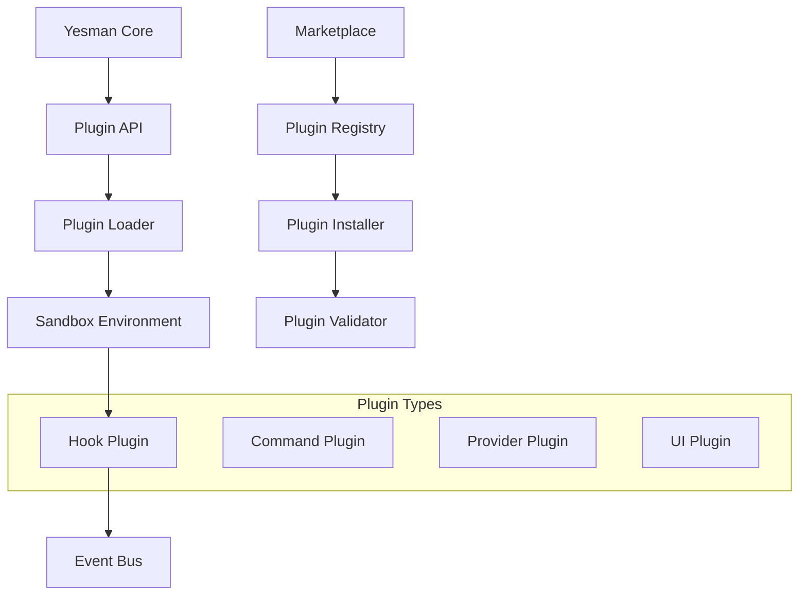

# Plugin Architecture Implementation Plan

## 📋 Overview

Design and implement a comprehensive plugin system that allows third-party developers to extend yesman-claude
functionality without modifying core code. The system will support various plugin types, provide sandboxed execution,
and include a marketplace for plugin distribution.

## 🎯 Goals

### Primary Goals

- Enable safe third-party extensions
- Provide rich plugin API with hooks
- Create plugin marketplace/registry
- Ensure security through sandboxing
- Support hot-reloading of plugins

### Success Criteria

- < 10ms plugin loading overhead
- 100% API stability between versions
- Zero core system crashes from plugins
- > 50 plugins in marketplace within 6 months

## 🏗️ Plugin Architecture

### System Overview



### Plugin Types

1. **Command Plugins**: Add new CLI commands
1. **Hook Plugins**: React to system events
1. **Provider Plugins**: Add new service providers
1. **UI Plugins**: Extend dashboard UI
1. **Integration Plugins**: Connect external services

## 📐 Detailed Design

### 1. Plugin Structure

```python
# Example plugin structure
my-plugin/
├── plugin.yaml          # Plugin manifest
├── requirements.txt     # Python dependencies
├── src/
│   ├── __init__.py
│   ├── main.py        # Plugin entry point
│   └── commands.py    # Command implementations
├── tests/
│   └── test_plugin.py
├── docs/
│   └── README.md
└── assets/
    └── icon.png
```

### 2. Plugin Manifest

```yaml
# plugin.yaml
name: github-integration
version: 1.0.0
author: "John Doe"
description: "GitHub integration for yesman-claude"
homepage: "https://github.com/user/yesman-github"
license: MIT

# Plugin metadata
yesman:
  min_version: "0.11.0"
  max_version: "1.0.0"

# Plugin type and capabilities
type: integration
provides:
  - commands:
      - name: gh-create-pr
        description: "Create GitHub PR from current session"
      - name: gh-sync
        description: "Sync session with GitHub repository"
  - hooks:
      - name: session.created
        handler: on_session_created
      - name: session.closed
        handler: on_session_closed
  - providers:
      - name: github
        interface: IVersionControlProvider

# Dependencies
dependencies:
  - pygithub>=1.55
  - gitpython>=3.1.0

# Permissions required
permissions:
  - network.external
  - filesystem.read
  - filesystem.write
  - session.read
  - session.modify

# Configuration schema
config:
  type: object
  properties:
    github_token:
      type: string
      description: "GitHub personal access token"
      required: true
    default_branch:
      type: string
      default: "main"
      description: "Default branch for PRs"
```

### 3. Plugin API

```python
# libs/plugins/api.py
from abc import ABC, abstractmethod
from typing import Dict, Any, List, Optional, Callable
from dataclasses import dataclass
import asyncio

@dataclass
class PluginContext:
    """Context provided to plugins"""
    plugin_id: str
    plugin_dir: str
    config: Dict[str, Any]
    logger: logging.Logger
    session_manager: 'SessionManager'
    tmux_manager: 'TmuxManager'
    event_bus: 'EventBus'

class PluginBase(ABC):
    """Base class for all plugins"""
    
    def __init__(self, context: PluginContext):
        self.context = context
        self.logger = context.logger
        
    @abstractmethod
    async def initialize(self) -> None:
        """Initialize plugin"""
        pass
    
    @abstractmethod
    async def cleanup(self) -> None:
        """Cleanup plugin resources"""
        pass
    
    def get_commands(self) -> List['Command']:
        """Return list of commands provided by plugin"""
        return []
    
    def get_hooks(self) -> Dict[str, Callable]:
        """Return dict of event hooks"""
        return {}
    
    def get_providers(self) -> Dict[str, 'Provider']:
        """Return dict of service providers"""
        return {}

class CommandPlugin(PluginBase):
    """Plugin that provides CLI commands"""
    
    @abstractmethod
    def get_commands(self) -> List['Command']:
        """Must return list of commands"""
        pass

class HookPlugin(PluginBase):
    """Plugin that hooks into system events"""
    
    @abstractmethod
    def get_hooks(self) -> Dict[str, Callable]:
        """Must return event hooks"""
        pass

# Command interface
class PluginCommand:
    def __init__(self, 
                 name: str,
                 description: str,
                 handler: Callable,
                 options: List[Dict[str, Any]] = None):
        self.name = name
        self.description = description
        self.handler = handler
        self.options = options or []
    
    def to_click_command(self):
        """Convert to Click command"""
        import click
        
        cmd = click.command(name=self.name, help=self.description)(self.handler)
        
        for option in self.options:
            cmd = click.option(
                option['name'],
                option.get('short'),
                **{k: v for k, v in option.items() 
                   if k not in ['name', 'short']}
            )(cmd)
        
        return cmd

# Provider interfaces
class IProvider(ABC):
    """Base interface for service providers"""
    
    @abstractmethod
    async def connect(self) -> None:
        pass
    
    @abstractmethod
    async def disconnect(self) -> None:
        pass

class IVersionControlProvider(IProvider):
    """Interface for version control providers"""
    
    @abstractmethod
    async def create_branch(self, name: str) -> None:
        pass
    
    @abstractmethod
    async def commit(self, message: str, files: List[str]) -> str:
        pass
    
    @abstractmethod
    async def push(self, branch: str) -> None:
        pass
    
    @abstractmethod
    async def create_pull_request(self, 
                                 title: str, 
                                 body: str,
                                 base: str,
                                 head: str) -> str:
        pass
```

### 4. Plugin Loader and Manager

```python
# libs/plugins/loader.py
import importlib.util
import yaml
from pathlib import Path
from typing import Dict, List, Optional, Any
import subprocess
import venv
import sys

class PluginLoader:
    def __init__(self, plugins_dir: str = "~/.yesman/plugins"):
        self.plugins_dir = Path(plugins_dir).expanduser()
        self.plugins_dir.mkdir(parents=True, exist_ok=True)
        self.loaded_plugins: Dict[str, 'LoadedPlugin'] = {}
        
    async def discover_plugins(self) -> List[Dict[str, Any]]:
        """Discover all available plugins"""
        plugins = []
        
        for plugin_dir in self.plugins_dir.iterdir():
            if not plugin_dir.is_dir():
                continue
                
            manifest_path = plugin_dir / "plugin.yaml"
            if not manifest_path.exists():
                continue
            
            try:
                with open(manifest_path) as f:
                    manifest = yaml.safe_load(f)
                    manifest['path'] = str(plugin_dir)
                    plugins.append(manifest)
            except Exception as e:
                self.logger.error(f"Failed to load manifest for {plugin_dir}: {e}")
        
        return plugins
    
    async def load_plugin(self, plugin_name: str) -> Optional['LoadedPlugin']:
        """Load a specific plugin"""
        plugin_dir = self.plugins_dir / plugin_name
        
        if not plugin_dir.exists():
            raise ValueError(f"Plugin {plugin_name} not found")
        
        # Load manifest
        manifest_path = plugin_dir / "plugin.yaml"
        with open(manifest_path) as f:
            manifest = yaml.safe_load(f)
        
        # Validate manifest
        self._validate_manifest(manifest)
        
        # Check permissions
        if not self._check_permissions(manifest.get('permissions', [])):
            raise PermissionError(f"Plugin {plugin_name} requires unauthorized permissions")
        
        # Create virtual environment for plugin
        venv_dir = plugin_dir / ".venv"
        if not venv_dir.exists():
            await self._create_plugin_venv(plugin_dir, manifest)
        
        # Load plugin module
        module = await self._load_plugin_module(plugin_dir, venv_dir)
        
        # Create plugin instance
        context = PluginContext(
            plugin_id=plugin_name,
            plugin_dir=str(plugin_dir),
            config=self._load_plugin_config(plugin_name),
            logger=self._create_plugin_logger(plugin_name),
            session_manager=self.session_manager,
            tmux_manager=self.tmux_manager,
            event_bus=self.event_bus
        )
        
        # Find and instantiate plugin class
        plugin_class = self._find_plugin_class(module)
        plugin_instance = plugin_class(context)
        
        # Initialize plugin
        await plugin_instance.initialize()
        
        # Create loaded plugin wrapper
        loaded_plugin = LoadedPlugin(
            name=plugin_name,
            manifest=manifest,
            module=module,
            instance=plugin_instance,
            venv_dir=venv_dir
        )
        
        self.loaded_plugins[plugin_name] = loaded_plugin
        
        return loaded_plugin
    
    async def _create_plugin_venv(self, plugin_dir: Path, manifest: Dict[str, Any]):
        """Create isolated virtual environment for plugin"""
        venv_dir = plugin_dir / ".venv"
        
        # Create venv
        venv.create(venv_dir, with_pip=True)
        
        # Install dependencies
        pip_path = venv_dir / "bin" / "pip"
        requirements_path = plugin_dir / "requirements.txt"
        
        if requirements_path.exists():
            subprocess.run(
                [str(pip_path), "install", "-r", str(requirements_path)],
                check=True
            )
        
        # Install manifest dependencies
        for dep in manifest.get('dependencies', []):
            subprocess.run(
                [str(pip_path), "install", dep],
                check=True
            )
    
    async def _load_plugin_module(self, plugin_dir: Path, venv_dir: Path):
        """Load plugin module from virtual environment"""
        # Add venv site-packages to path
        site_packages = venv_dir / "lib" / f"python{sys.version_info.major}.{sys.version_info.minor}" / "site-packages"
        sys.path.insert(0, str(site_packages))
        
        # Load plugin module
        module_path = plugin_dir / "src" / "main.py"
        spec = importlib.util.spec_from_file_location(
            f"plugins.{plugin_dir.name}",
            module_path
        )
        module = importlib.util.module_from_spec(spec)
        spec.loader.exec_module(module)
        
        return module
```

### 5. Plugin Sandbox

```python
# libs/plugins/sandbox.py
import resource
import signal
import multiprocessing
from typing import Any, Callable, Dict, Optional
import pickle
import traceback

class PluginSandbox:
    """Sandbox for secure plugin execution"""
    
    def __init__(self,
                 max_memory_mb: int = 100,
                 max_cpu_seconds: int = 10,
                 max_file_descriptors: int = 50):
        self.max_memory_mb = max_memory_mb
        self.max_cpu_seconds = max_cpu_seconds
        self.max_file_descriptors = max_file_descriptors
    
    async def execute(self, 
                     func: Callable,
                     *args,
                     timeout: int = 30,
                     **kwargs) -> Any:
        """Execute function in sandboxed environment"""
        
        # Create pipe for communication
        parent_conn, child_conn = multiprocessing.Pipe()
        
        # Create process
        process = multiprocessing.Process(
            target=self._sandbox_worker,
            args=(func, args, kwargs, child_conn)
        )
        
        # Start process
        process.start()
        
        # Wait for result with timeout
        if parent_conn.poll(timeout):
            result = parent_conn.recv()
            
            if isinstance(result, Exception):
                raise result
            
            return result
        else:
            # Timeout - kill process
            process.terminate()
            process.join(timeout=5)
            
            if process.is_alive():
                process.kill()
            
            raise TimeoutError(f"Plugin execution timed out after {timeout}s")
    
    def _sandbox_worker(self, func: Callable, args: tuple, kwargs: dict, conn):
        """Worker process with resource limits"""
        try:
            # Set resource limits
            self._set_resource_limits()
            
            # Execute function
            result = func(*args, **kwargs)
            
            # Send result
            conn.send(result)
            
        except Exception as e:
            # Send exception
            conn.send(e)
        finally:
            conn.close()
    
    def _set_resource_limits(self):
        """Set resource limits for sandbox"""
        # Memory limit
        memory_bytes = self.max_memory_mb * 1024 * 1024
        resource.setrlimit(resource.RLIMIT_AS, (memory_bytes, memory_bytes))
        
        # CPU time limit
        resource.setrlimit(resource.RLIMIT_CPU, (self.max_cpu_seconds, self.max_cpu_seconds))
        
        # File descriptor limit
        resource.setrlimit(resource.RLIMIT_NOFILE, (self.max_file_descriptors, self.max_file_descriptors))
        
        # Disable core dumps
        resource.setrlimit(resource.RLIMIT_CORE, (0, 0))
        
        # Set nice level (lower priority)
        os.nice(10)

class PermissionManager:
    """Manage plugin permissions"""
    
    PERMISSION_LEVELS = {
        'network.internal': 1,  # Access internal network
        'network.external': 2,  # Access external network
        'filesystem.read': 1,   # Read filesystem
        'filesystem.write': 2,  # Write filesystem
        'session.read': 1,      # Read session info
        'session.modify': 2,    # Modify sessions
        'system.execute': 3,    # Execute system commands
        'plugin.manage': 3,     # Manage other plugins
    }
    
    def __init__(self):
        self.granted_permissions: Dict[str, List[str]] = {}
    
    def request_permissions(self, 
                          plugin_id: str,
                          requested: List[str]) -> bool:
        """Request permissions for plugin"""
        # Check if permissions are valid
        for perm in requested:
            if perm not in self.PERMISSION_LEVELS:
                raise ValueError(f"Unknown permission: {perm}")
        
        # Show permission dialog to user
        if self._show_permission_dialog(plugin_id, requested):
            self.granted_permissions[plugin_id] = requested
            self._save_permissions()
            return True
        
        return False
    
    def check_permission(self, plugin_id: str, permission: str) -> bool:
        """Check if plugin has permission"""
        return permission in self.granted_permissions.get(plugin_id, [])
    
    def _show_permission_dialog(self, 
                               plugin_id: str,
                               requested: List[str]) -> bool:
        """Show permission request dialog to user"""
        print(f"\nPlugin '{plugin_id}' is requesting the following permissions:")
        
        for perm in requested:
            level = self.PERMISSION_LEVELS[perm]
            level_str = ['Low', 'Medium', 'High'][level - 1]
            print(f"  - {perm} (Risk: {level_str})")
        
        response = input("\nGrant these permissions? (y/N): ")
        return response.lower() == 'y'
```

### 6. Plugin Marketplace

```python
# libs/plugins/marketplace.py
import aiohttp
from typing import List, Dict, Any, Optional
import tempfile
import tarfile
import hashlib

class PluginMarketplace:
    """Interface to plugin marketplace"""
    
    def __init__(self, marketplace_url: str = "https://plugins.yesman-claude.io"):
        self.marketplace_url = marketplace_url
        self.session = None
    
    async def __aenter__(self):
        self.session = aiohttp.ClientSession()
        return self
    
    async def __aexit__(self, exc_type, exc_val, exc_tb):
        await self.session.close()
    
    async def search_plugins(self, 
                           query: str = "",
                           category: Optional[str] = None,
                           sort_by: str = "popularity") -> List[Dict[str, Any]]:
        """Search for plugins in marketplace"""
        params = {
            'q': query,
            'category': category,
            'sort': sort_by
        }
        
        async with self.session.get(
            f"{self.marketplace_url}/api/plugins",
            params=params
        ) as response:
            return await response.json()
    
    async def get_plugin_details(self, plugin_id: str) -> Dict[str, Any]:
        """Get detailed information about a plugin"""
        async with self.session.get(
            f"{self.marketplace_url}/api/plugins/{plugin_id}"
        ) as response:
            return await response.json()
    
    async def download_plugin(self, 
                            plugin_id: str,
                            version: Optional[str] = None) -> str:
        """Download plugin package"""
        # Get download URL
        details = await self.get_plugin_details(plugin_id)
        
        if version:
            download_url = next(
                v['download_url'] for v in details['versions'] 
                if v['version'] == version
            )
        else:
            download_url = details['latest_version']['download_url']
        
        # Download to temp file
        with tempfile.NamedTemporaryFile(delete=False, suffix='.tar.gz') as tmp:
            async with self.session.get(download_url) as response:
                async for chunk in response.content.iter_chunked(8192):
                    tmp.write(chunk)
            
            return tmp.name
    
    async def install_plugin(self, 
                           plugin_id: str,
                           version: Optional[str] = None) -> None:
        """Download and install plugin"""
        # Download package
        package_path = await self.download_plugin(plugin_id, version)
        
        try:
            # Verify package integrity
            await self._verify_package(package_path, plugin_id)
            
            # Extract to plugins directory
            plugins_dir = Path("~/.yesman/plugins").expanduser()
            
            with tarfile.open(package_path, 'r:gz') as tar:
                # Security check - ensure no path traversal
                for member in tar.getmembers():
                    if member.name.startswith('..') or member.name.startswith('/'):
                        raise SecurityError(f"Unsafe path in package: {member.name}")
                
                # Extract
                tar.extractall(plugins_dir)
            
            print(f"Successfully installed plugin: {plugin_id}")
            
        finally:
            # Clean up temp file
            os.unlink(package_path)
    
    async def _verify_package(self, package_path: str, plugin_id: str):
        """Verify package integrity and signature"""
        # Get expected hash from marketplace
        details = await self.get_plugin_details(plugin_id)
        expected_hash = details['latest_version']['sha256']
        
        # Calculate actual hash
        sha256_hash = hashlib.sha256()
        with open(package_path, 'rb') as f:
            for chunk in iter(lambda: f.read(4096), b""):
                sha256_hash.update(chunk)
        
        actual_hash = sha256_hash.hexdigest()
        
        if actual_hash != expected_hash:
            raise SecurityError("Package integrity check failed")

class PluginRegistry:
    """Local registry of installed plugins"""
    
    def __init__(self, registry_path: str = "~/.yesman/plugin_registry.json"):
        self.registry_path = Path(registry_path).expanduser()
        self.registry = self._load_registry()
    
    def register_plugin(self, plugin_info: Dict[str, Any]):
        """Register installed plugin"""
        plugin_id = plugin_info['name']
        self.registry[plugin_id] = {
            'version': plugin_info['version'],
            'installed_at': datetime.now().isoformat(),
            'manifest': plugin_info
        }
        self._save_registry()
    
    def unregister_plugin(self, plugin_id: str):
        """Remove plugin from registry"""
        if plugin_id in self.registry:
            del self.registry[plugin_id]
            self._save_registry()
    
    def get_installed_plugins(self) -> Dict[str, Any]:
        """Get all installed plugins"""
        return self.registry.copy()
    
    def is_installed(self, plugin_id: str) -> bool:
        """Check if plugin is installed"""
        return plugin_id in self.registry
```

## 🔄 Implementation Phases

### Phase 1: Core Plugin System (3 days)

- [ ] Implement plugin base classes
- [ ] Create plugin loader
- [ ] Add manifest validation
- [ ] Set up plugin discovery

### Phase 2: Sandbox & Security (3 days)

- [ ] Implement sandboxed execution
- [ ] Add resource limits
- [ ] Create permission system
- [ ] Add security validation

### Phase 3: Plugin Types (4 days)

- [ ] Implement command plugins
- [ ] Add hook system
- [ ] Create provider interfaces
- [ ] Add UI plugin support

### Phase 4: Marketplace (3 days)

- [ ] Create marketplace API client
- [ ] Implement plugin installation
- [ ] Add package verification
- [ ] Create registry system

### Phase 5: Developer Tools (2 days)

- [ ] Create plugin template
- [ ] Add development CLI
- [ ] Create testing framework
- [ ] Write documentation

### Phase 6: Integration (2 days)

- [ ] Integrate with existing systems
- [ ] Add plugin management UI
- [ ] Create example plugins
- [ ] Performance optimization

## 🧪 Testing Strategy

### Plugin Development Kit

```python
# tests/plugins/test_plugin_development.py
from yesman.plugins.testing import PluginTestCase

class TestGitHubPlugin(PluginTestCase):
    plugin_name = "github-integration"
    
    async def test_create_pr_command(self):
        """Test PR creation command"""
        # Mock GitHub API
        self.mock_external_api('github.com', self.github_mock)
        
        # Execute command
        result = await self.execute_command('gh-create-pr', 
                                          title="Test PR",
                                          body="Test body")
        
        # Verify
        assert result['success']
        assert 'pr_url' in result

    async def test_permissions(self):
        """Test plugin respects permissions"""
        # Revoke network permission
        self.revoke_permission('network.external')
        
        # Should fail
        with pytest.raises(PermissionError):
            await self.execute_command('gh-create-pr')
```

### Security Testing

```python
# tests/plugins/test_plugin_security.py
async def test_sandbox_memory_limit():
    """Test plugin cannot exceed memory limit"""
    plugin = await load_plugin('malicious-plugin')
    
    with pytest.raises(MemoryError):
        # Plugin tries to allocate 1GB
        await plugin.execute_in_sandbox(allocate_memory, size='1GB')

async def test_sandbox_cpu_limit():
    """Test plugin cannot consume excessive CPU"""
    plugin = await load_plugin('cpu-intensive-plugin')
    
    with pytest.raises(TimeoutError):
        # Plugin tries infinite loop
        await plugin.execute_in_sandbox(infinite_loop)

async def test_filesystem_isolation():
    """Test plugin cannot access unauthorized paths"""
    plugin = await load_plugin('filesystem-plugin')
    
    # Should not be able to read /etc/passwd
    with pytest.raises(PermissionError):
        await plugin.read_file('/etc/passwd')
```

## 📊 Performance Requirements

### Loading Performance

- Plugin discovery: < 100ms
- Plugin loading: < 500ms per plugin
- Total startup overhead: < 2s with 20 plugins

### Runtime Performance

- Hook execution: < 10ms overhead
- Command execution: < 50ms overhead
- Memory per plugin: < 50MB

### Marketplace Performance

- Search response: < 500ms
- Plugin download: Based on size (>1MB/s)
- Installation time: < 30s for average plugin

## 🔒 Security Considerations

### Sandboxing

- Process isolation using multiprocessing
- Resource limits (CPU, memory, file descriptors)
- No network access without permission
- Filesystem access restrictions

### Code Validation

- Static analysis before loading
- Dangerous import detection
- API usage validation
- Dependency scanning

### Marketplace Security

- Package signature verification
- SHA256 integrity checks
- Malware scanning
- Community reporting system

## 📚 Plugin Examples

### Example: GitHub Integration

```python
# plugins/github-integration/src/main.py
from yesman.plugins import CommandPlugin, PluginCommand
from github import Github

class GitHubIntegrationPlugin(CommandPlugin):
    async def initialize(self):
        """Initialize GitHub client"""
        token = self.context.config['github_token']
        self.github = Github(token)
        self.logger.info("GitHub integration initialized")
    
    def get_commands(self):
        return [
            PluginCommand(
                name="gh-create-pr",
                description="Create GitHub PR from current session",
                handler=self.create_pr,
                options=[
                    {'name': '--title', 'required': True},
                    {'name': '--body', 'required': True},
                    {'name': '--base', 'default': 'main'},
                ]
            )
        ]
    
    async def create_pr(self, title: str, body: str, base: str):
        """Create pull request"""
        # Get current session info
        session = self.context.session_manager.get_current_session()
        
        # Create PR
        repo = self.github.get_repo(session.metadata.get('repo'))
        pr = repo.create_pull(
            title=title,
            body=body,
            base=base,
            head=session.metadata.get('branch')
        )
        
        self.logger.info(f"Created PR: {pr.html_url}")
        return {'success': True, 'pr_url': pr.html_url}
```

## ✅ Definition of Done

- [ ] Core plugin system implemented
- [ ] All plugin types supported
- [ ] Sandbox security verified
- [ ] Marketplace API functional
- [ ] 5+ example plugins created
- [ ] Developer documentation complete
- [ ] Security audit passed
- [ ] Performance benchmarks met

______________________________________________________________________

**Created**: 2025-01-08 **Owner**: Platform Team **Status**: Planning **Estimated Effort**: 17 days
